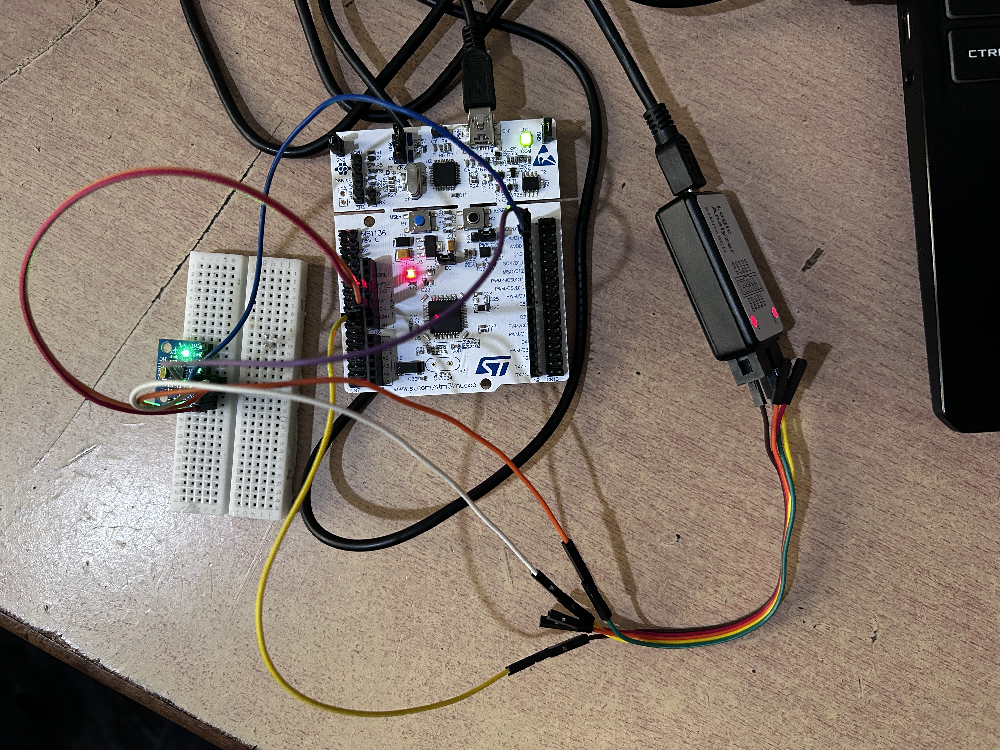
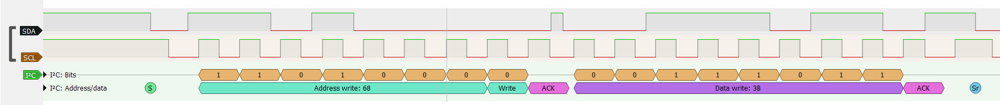
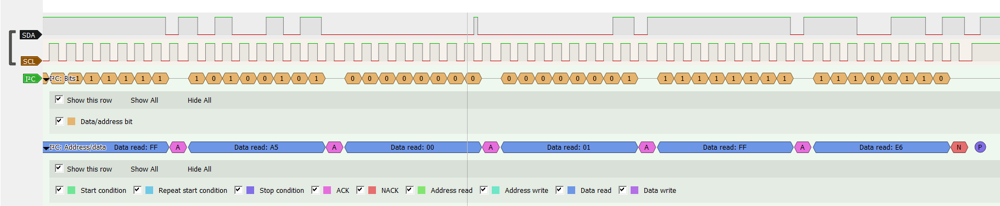
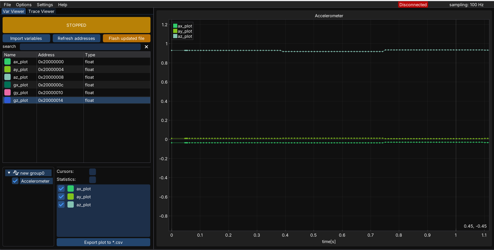
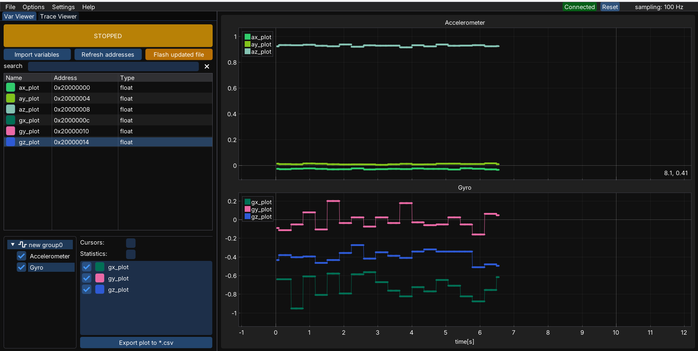

<div align="center">

# I2C_bitbanging

**BARE METAL, NO HAL**

**A from-scratch I2C master, built by directly toggling GPIO registers.** No HAL, no
CMSIS, no vendor libraries — custom startup file, custom linker script, on a bare-metal
STM32F446RE. Verified against a real MPU6050 IMU three separate ways: on the wire, in
the debugger, and on a live plot.


</div>

---

**Setup**



## Proof it works

**1. Logic analyzer — the exact bytes on the wire, decoded**

<!-- screenshot: I2C decode showing AW:68, ACK, 3B, repeated START, AR:68, 14 bytes, NACK+STOP -->






**2. Live sensor values, plotted in real time (MCUViewer, over SWD)**

<!-- screenshot: az settling near 1g with the board flat -->





**3. Reading the struct directly in GDB after `load`**

<!-- screenshot or snippet: (gdb) print data → ax/ay/az/gx/gy/gz -->

The board is flat and stationary in the capture above: `az ≈ 0.93 g`, `ax`/`ay ≈ 0`,
which is exactly what gravity on a level accelerometer should read.

## What this actually is

- I2C protocol (START, repeated START, STOP, ACK/NACK, clock stretching) implemented in
  software on two open-drain GPIOs (PB8/PB9) — not the STM32's hardware I2C peripheral
- Hand-written Cortex-M4 startup: vector table, `Reset_Handler`, FPU enable, `.data`/`.bss`
  init — no ST-generated startup file
- Hand-written linker script — no CubeIDE/CubeMX project behind this
- MPU6050 driver on top: wake-up, 14-byte burst read via repeated START, raw → g / °/s
- Built with a plain Makefile + `arm-none-eabi-gcc`, flashed and debugged over OpenOCD/GDB

## Wiring

| MPU6050 | Nucleo pin |
|---|---|
| VCC | 3V3 |
| GND | GND |
| SCL | PB8 (D15) |
| SDA | PB9 (D14) |

Needs pull-ups (~4.7 kΩ to 3.3 V) on SDA/SCL — Dont need if the MPU-6050 u possess already has them.

## Build & flash

```
make clean && make
```

Produces `BareMetal.elf` / `BareMetal.bin`. Drag `BareMetal.bin` onto the Nucleo's USB
drive, or:

```
openocd -f interface/stlink.cfg -f target/stm32f4x.cfg -c "program BareMetal.elf verify reset exit"
```

## Debug / watch live data

```
openocd -f interface/stlink.cfg -f target/stm32f4x.cfg
arm-none-eabi-gdb BareMetal.elf
  (gdb) target extended-remote localhost:3333
  (gdb) monitor reset halt
  (gdb) load
  (gdb) continue
```

Ctrl+C anytime, then `print data` to see live accel/gyro values.

## Repo layout

```
inc/                    Register map, I2C driver, MPU6050 driver headers
src/                     i2c_bitbanging.c  MPU6050.c  main.c
startup_stm32f446RE.c   Vector table + Reset_Handler
Linkerdescription.ld    Flash/RAM layout
Makefile
```

## License

See [LICENSE](LICENSE).